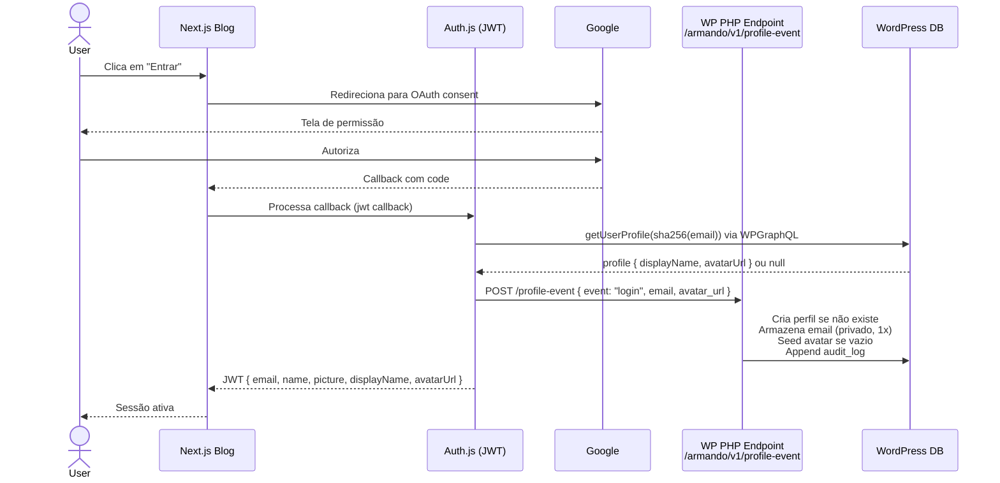
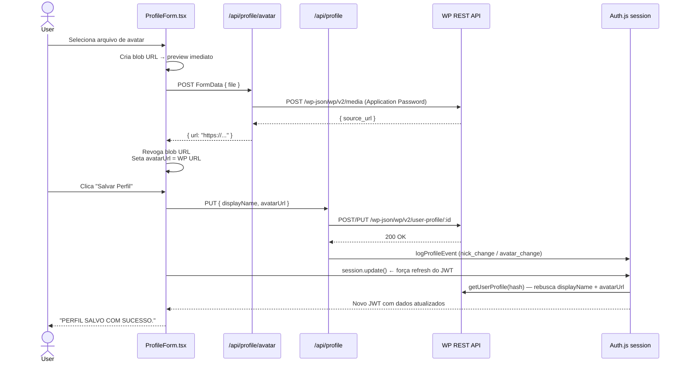
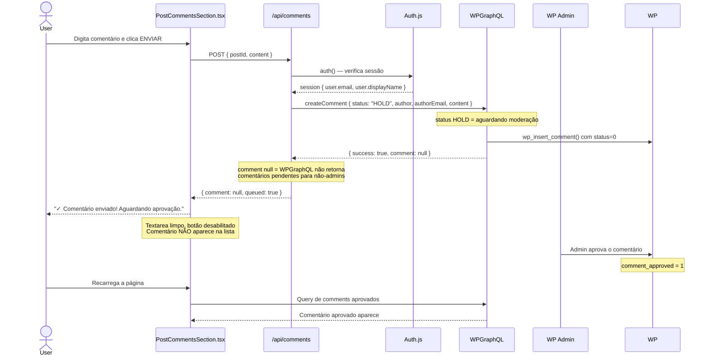
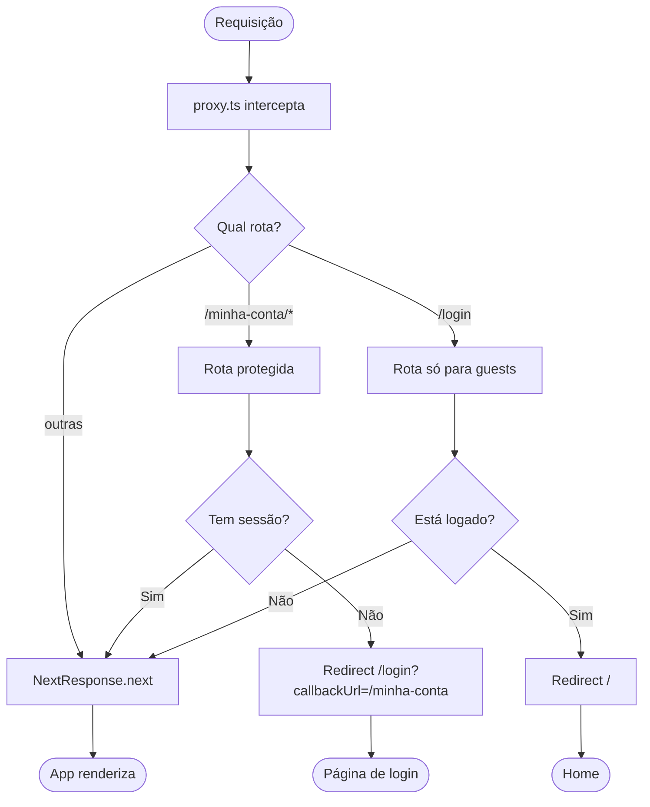

# Authentication Deep Dive

> Aprendizados, trade-offs e decisões técnicas da implementação completa de auth no blog.  
> Cobre: OAuth, JWT, perfis no WP, avatar upload, moderação de comentários e proxy de rotas.

---

## Stack escolhida

| Camada | Tecnologia | Alternativa descartada |
|---|---|---|
| Auth provider | **Auth.js v5 (next-auth@beta)** | Clerk, Supabase Auth |
| Estratégia de sessão | **JWT stateless** | Database sessions |
| OAuth provider | **Google apenas** | GitHub, credentials |
| Perfis de usuário | **WP CPT `user-profile`** | Tabela separada, banco externo |
| Avatares | **WP Media Library** | Cloudinary, S3 |
| Identificador de usuário | **SHA-256 do email** | UUID, sub do Google |

**Por que Auth.js v5?** É a integração oficial com Next.js App Router. O `auth()` funciona tanto em Server Components quanto em route handlers sem configuração extra. A versão v5 (beta) foi escolhida porque a v4 não suporta App Router nativamente.

**Por que JWT em vez de database sessions?** Zero infra adicional. O blog é um projeto pessoal — adicionar uma tabela de sessões só para invalidação seria over-engineering. O trade-off (tokens não invalidáveis antes do vencimento) é aceitável aqui.

**Por que Google apenas?** Reduz superfície de ataque (sem gestão de passwords) e é o provider mais usado pelo público-alvo.

---

## Fluxo 1 — Login OAuth



**Aprendizado:** O callback `jwt` roda em toda criação/renovação de token. O `trigger` (`"signIn"`, `"signUp"`, `"update"`) é essencial para não fazer round-trip ao WP em cada request — só busca o profile quando necessário.

---

## Fluxo 2 — Atualização de perfil



**Aprendizado crítico — Blob URL pattern com `AppImage`:**

`URL.createObjectURL(file)` gera uma URL local temporária para preview instantâneo enquanto o upload acontece. O `next/image` normalmente não suporta blob URLs (a otimização requer uma URL remota real). A solução é o `AppImage` detectar automaticamente:

```tsx
// AppImage.tsx — detecção automática de blob: e data:
const isBlobOrData = srcStr.startsWith("blob:") || srcStr.startsWith("data:");

<Image
  {...props}
  unoptimized={isBlobOrData || unoptimized}  // ← key decision
/>
```

Isso significa que **sempre se usa `<AppImage>`** — nunca `` cru. O componente sabe quando usar o optimizer e quando bypassar. Quando a URL definitiva do WP chegar, `URL.revokeObjectURL(blob)` libera memória e o `AppImage` automaticamente volta ao modo otimizado.

**Trade-off:** `unoptimized` desabilita o resize/compress do Next.js para aquela imagem. Durante o preview (blob) isso é intencional e temporário — a URL final do WP entra otimizada normalmente.

**Aprendizado crítico — Token migration:** Quando um novo campo é adicionado ao JWT (ex: `avatarUrl`), usuários com tokens existentes **não recebem o novo campo automaticamente**. O cookie está encriptado e não é recriado até que o token expire ou `session.update()` seja chamado. Mitigação: chamar `session.update()` após salvar o perfil força o JWT callback a rodar novamente.

---

## Fluxo 3 — Submissão de comentário



**Aprendizado:** `wpMutation` usa Application Password (credenciais de admin). O WPGraphQL ao criar o comentário via API chama `wp_insert_comment()` diretamente — diferente do formulário HTML do WP, que passa por `wp_allow_comment()`. Definir `status: "HOLD"` explicitamente força o status independente de quem está autenticado.

---

## Fluxo 4 — Proteção de rotas (proxy.ts)



**Aprendizado — Next.js 16 renomeou middleware:** O arquivo `middleware.ts` foi deprecado em v16 e renomeado para `proxy.ts`. O runtime mudou de Edge para **Node.js** por padrão. O wrapper `auth()` do Auth.js continua funcionando como default export — a lógica não muda, só o nome do arquivo.

```
middleware.ts (v15)  →  proxy.ts (v16)
export default auth(...) permanece igual
```

---

## Armazenamento de dados no WordPress

```
WP CPT: user-profile (post)
├── slug/title: sha256(email)          ← identificador público sem PII
├── meta: display_name                 ← nome de exibição (público via GraphQL)
├── meta: avatar_url                   ← URL do avatar (público via GraphQL)
├── meta: user_email (PRIVADO)         ← show_in_rest: false, show_in_graphql: false
└── meta: audit_log (PRIVADO)          ← show_in_rest: false, show_in_graphql: false
    ├── { event: "login", at, ip }
    ├── { event: "nick_change", from, to, at }
    └── { event: "avatar_change", at }
```

**Por que hash do email como slug?** O WP CPT é público (necessário para consultas GraphQL). Usar o email diretamente como slug exporia PII em URLs, sitemaps e feeds. O SHA-256 é determinístico (o mesmo email sempre gera o mesmo hash) mas irreversível — dá pra encontrar o perfil pelo email mas não dá pra descobrir o email pelo slug.

**Por que um único endpoint PHP?** `armando/v1/profile-event` centraliza em um único lugar: criação de perfil, armazenamento do email (executado apenas uma vez — nunca sobrescreve), seed do avatar, e append do audit log. Chamar 4 endpoints REST separados seria frágil — se um falha a meio, o estado fica inconsistente.

---

## Trade-offs resumidos

| Decisão | Vantagem | Custo |
|---|---|---|
| JWT stateless | Zero infra, simplicidade | Logout não invalida token imediatamente |
| displayName + avatarUrl no JWT | Sem round-trip ao WP em cada request | Dado pode ficar stale; exige `session.update()` após mudanças |
| Google OAuth only | Sem gestão de senha, mais seguro | Usuários sem Google não conseguem logar |
| SHA-256 como identificador | Sem PII em URLs públicas | Lookup requer hash do email antes de qualquer query |
| WP Media Library para avatares | Sem serviço externo, backups incluídos | Limite de tamanho e formatos do WP |
| Comentários como HOLD | Controle total de moderação | Admin precisa aprovar manualmente cada comentário |
| Endpoint PHP único | Atomicidade, sem inconsistência de estado | Lógica de negócio acoplada ao PHP do WP |

---

## Gotchas documentados

### 1. `auth()` no proxy vs Edge Runtime
O proxy.ts roda em Node.js (não Edge). O `auth()` do Auth.js foi originalmente desenhado para Edge, mas funciona em Node.js também na v5. Se em algum momento der problema de compatibilidade, a alternativa é `getToken({ req, secret })` de `next-auth/jwt` que lê o cookie diretamente.

### 2. Ramos divergentes no git
Quando branches ficam muito tempo sem ser rebased em main, `git pull` falha com "divergent branches". Solução: `git pull origin main --rebase` em vez de `git pull` simples.

### 3. Admins do WP bypassam moderação em comentários via formulário HTML
Ao submeter comentário pelo formulário HTML do WP como admin, o `wp_allow_comment()` auto-aprova. Via `wp_insert_comment()` direto (rota da API), o status explícito é respeitado. A implementação usa a API, então `status: "HOLD"` funciona corretamente.

### 4. `AppImage` lida com blob URLs automaticamente via `unoptimized`
Blob URLs (`blob:http://...`) e data URIs não podem ser processados pelo optimizer do `next/image`. O `AppImage` detecta o prefixo (`blob:` ou `data:`) e seta `unoptimized={true}` automaticamente. Nunca usar `` cru no projeto — sempre `<AppImage>`, que adapta o comportamento conforme o tipo de URL.

---

## Referências

- [Auth.js v5 docs](https://authjs.dev/)
- [WPGraphQL createComment mutation](https://www.wpgraphql.com/)
- [Next.js 16 — proxy.ts file convention](../node_modules/next/dist/docs/01-app/03-api-reference/03-file-conventions/proxy.md)
- [ADR-012 — JWT avatarUrl cache e token migration](../docs/adr/ADR-012-jwt-avatarurl-cache-and-token-migration.md)
- [Pitfalls do projeto](../docs/pitfalls/README.md)
